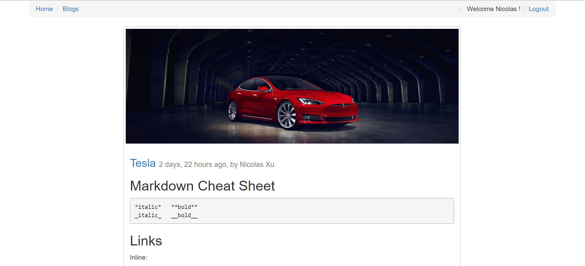
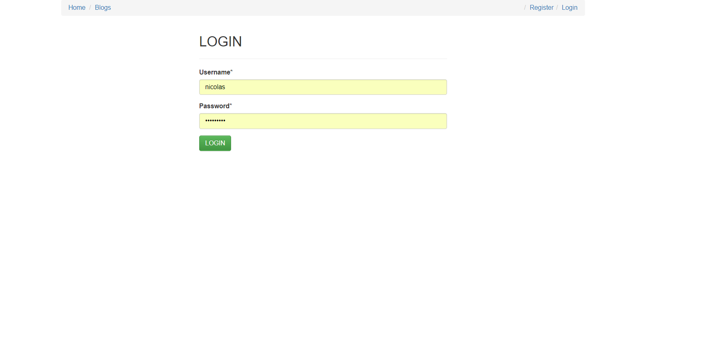

Travis CI Unit Test Result: 

### snapshots: 

#### Home Page

#### Login Page

### Brief summary:

  **1. A basic blog Django project, which enables**
        * Create/View/Edit/Delete Blogs.
        * Slugify blog url with unique slug id 
        * Comments thread, Reply, Delete 
        * Accounts: login, register, logout 
        * Security: login needed for specific actions: delete blog, comment deletion, post a comment
        * Integrate Travis CI tool to run unit test and display result dynamically
        
        
  **2. Use bootstrap, jqeury, javascript, pagedown, crispyforms, breadcrumbs to render the Layout**
  
  **3. Integrate virtualenv to isolate different env influence

### Installation: 
  1. git clone or download this project
  
  2. cd to the project folder (top level)
  
  3. virtualenv .env
  
  4. .env\Scriptes\activate (windows)    or   source .venv/bin/activate (linux)
 
  5. pip install -r requirement
 
  6. python manage.py runserver
 
  7. login to "localhost:8000/blogs" to see blogs  
  > superuser might need to be reconfigured
  
  
### Url mappings:
  1.    /                 ------------ home
  2.    /blogs            ------------ home
  3.    /blogs/[1-9]+   -------------- blog details
  4.    /blogs/[1-9]/edit ------------ blog edit
  5.    /blogs/[1-9]/delete ---------- blog delete
  6.    /blogs/create ---------------- blog creation
  

